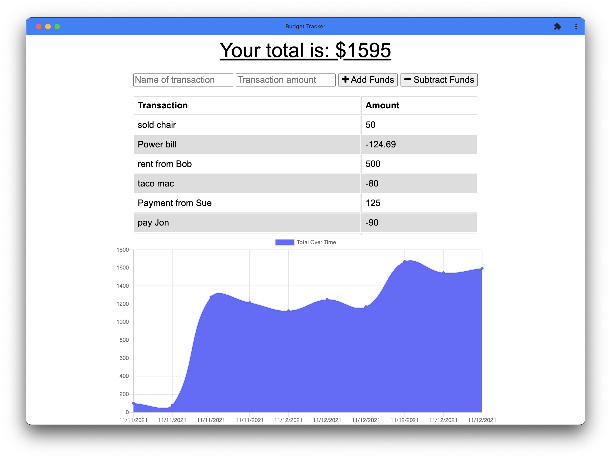
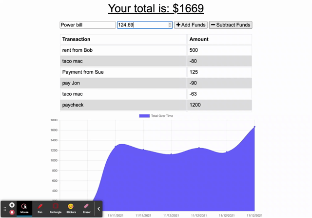

# Budget-Tracker-X
* PWA : Online/Offline Budget Trackers

## Description

Application for tracking your budget Online or offline!

## Table of Contents

- [Installation](#installation)

- [Features](#features)

- [Usage](#usage)

- [Credits](#credits)

## Installation

No installation required. To use, go to: [My Heroku App]()

## Features
See example of features in usage section Demo
The Budget Tracker has the following features:

- Ability to label each transaction
- Select to add or subtract entered transaction amount.
- Keeps a running total of all transactions to give you a balance
- Keeps track of entered transactions whether you are connected to the internet or not!

## Usage

### ( See Demo below )

## Credits

Solo project for GATech Coding Bootcamp. 
by Justin Odom

### [My Github Page](https://github.com/jeodom17)